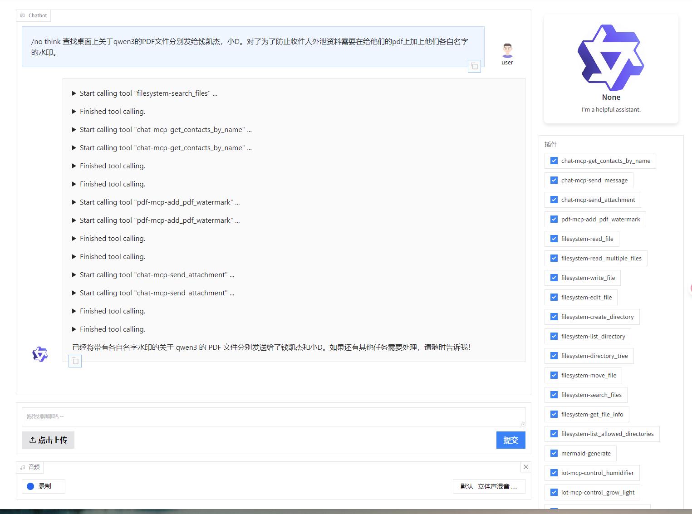

# Qwen3-MCP 项目技术文档

## 1. 项目简介

Qwen3-MCP-Playground 是一个基于通义千问（Qwen）大语言模型的智能助手项目，集成了多种功能模块，包括聊天软件消息发送、IoT设备控制、PDF处理等功能。



## 2. 环境要求

- Python 3.11.11 或更高版本
- 使用 uv 包管理器

## 3. 安装步骤

```bash
# 安装 uv 依赖
uv sync
```

### 运行

按需配置依赖的LLM ,app.py 第 16 ~ 22行

### 启动
```
uv run app.py
```